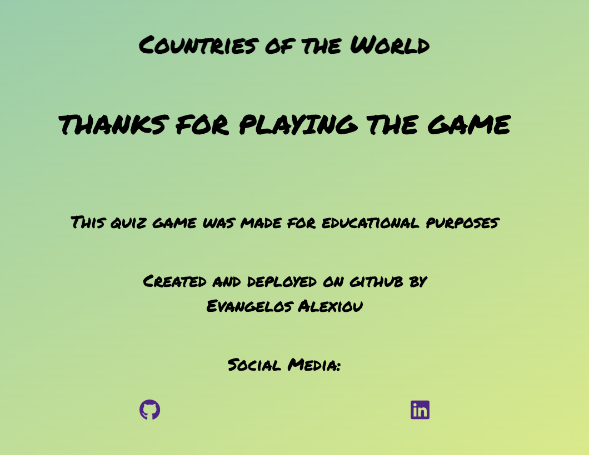

# COUNTRIES OF THE WORLD QUIZ
Countries of the World is an interactive quiz game that presents to the user a randomly selected flag at a time and offers four possible answers, asking the user which country is being displayed each time. It is ideal for all age groups from younger ages to older ones and its main purpose is to enhance the knowledge of this specific topic entertainingly.

The live site can be found [here](https://alexiou981.github.io/countries-of-the-world-quiz/)

## **Features**
### *Existing Features*

- __Landing Page__
- The landing page consists of:
    - The game title.
    - The earth flag of the game which is related to its countries.
    - The start button that runs the game.
    - The footer that consists of the clickable social media links, the purpose of the game and credits to the creator.

    

- __Gameplay Area__
- The gameplay area consists of:
    - The game title which stays on display throughout the entire game.
    - It outputs to the user the flag that was picked randomly out of the choices array.
    - It also, offers four possible answers with immediate validation (correct or incorrect answer).
    - At the bottom of the page is displayed the current player score.

- __Result Screen__
- The result screen:
    - Announces the final result of the game.
    - Offers the user two options for exiting or restarting the game.

- __Exit Screen__

- __Styling Choices__

    - The colour palette was created using [Coolors](https://coolors.co/)

    - I choose those colours to give the game a playful and relaxing mood.

    - There is sufficient contrast between background and foreground to enhance readability.

- __Typography__

- The font used for this game is Permanent Marker and was taken from Google Fonts.
- I chose this specific family since I wanted to give it a school-like type of writing since it's an educational game.

### *Potential Future Features*

- Add even more country flags, a nice touch would be to include all 195 flags available from [here](https://www.worldometers.info/geography/flags-of-the-world/).
- Add difficulty modes easy, which will include the most popular flags, medium, which will include those flags that are left out of the most and least popular flags and hard which will include the least popular country flags.
- Add another game mode which will allow the user to play the game by choosing globally or a specific continent.
- Add a countdown timer, instead of a question counter, that will allow the user to go through as many or as little flags as possible depending on the speed he proceeds to the next answer with.
- Lastly, change the duration of the countdown depending on the difficulty selected.

## **Mockup**

- This mockup was created using [Lucidchart](https://lucid.co/).
- I made it as simple as possible and I have used it as a map through the process of completing this quiz game project.

## **Testing**

- The website was tested through various devices and proven to be responsive in all screen sizes using the Google Chrome Inspector.
- Individually tested the game on the following devices:
    - Mobiles: Iphone 14 Pro Max, Xiaomi Redmi Note 9, Xiaomi POCO X5 Pro, Ipad Pro.
    - Laptops: Macbook Pro 13", ASUS Zenbook 13".

- All links to social media open in a new page.
- All images are displayed on the deployed site as well and there are no broken links or contents.

### *Validator Testing*
- Index.html passed through the [HTML](https://validator.w3.org/nu/) validator without any errors.
- Style.css passed through the [CSS](https://jigsaw.w3.org/css-validator/) validator without any errors.
- Script.js passed through the [JShint](https://jshint.com/) without any errors, only a warning about unused variables (startGame, nextQuestion, restart and exit), all of which are being used as an onclick="" in HTML.
- Choices.js passed through the [JShint](https://jshint.com/) without any errors, only a warning about the choices variable being unused, this is being accessed however by some parts of the code in the Script.js file.

### *Fixed Bugs* 
- This bug occurred when the area that includes the buttons in it was clicked and could only be reset upon refreshing the page.
- The frequency of it however rare would still cause a bad user experience since not only it turned the entire background color of the area red but it would also consider it as a wrong answer, when in reality there was no answer chosen at all.
- That was fixed by setting the pointer-events to none for the container that includes the buttons and setting the pointer-events to all for the buttons in CSS.

### *Unfixed Bugs*
- Not applicable.

## **Repository and Workspace Set Up**
-  Creating a repository on Github.com:
    - Click on the Repositories tab.
    - On the top right-hand corner there is a green button that says "New", click on that.
    - Give the new repository a name, "countries-of-the-world-quiz" in this case.
    - Ensure the repository is public by clicking on the Public button under the Description field.
    - Click on the Add README file in order to have this file included automatically.
    - Lastly, at the bottom right-hand corner click on "Create repository".
    - The new repository should be now available on the repositories tab on GitHub.

- Creating a workspace on Codeanywhere.com:
    - Login to your account, in this case, I logged in using my GitHub account.
    - On the workspaces tab click on the "New Workspace".
    - Go back to your Github repositories page and find the repository you want to create a workspace for, in this case, sourdough-enthusiasts.
    - Click on the repository and inside of it at the top right-hand corner there is a button that says "Code".
    - Click on the code button and copy the https URL from it.
    - Paste this URL in code anywhere inside the "Create from your project repository" field.
    - Click on the bottom right-hand corner of the green button that says create.
    - After a little while the workspace should be up and running.

## **Deployment** 
The website was deployed using Github.com. 
- The steps followed were: 
    - In the GitHub repository (countries-of-the-world-quiz) click on the Setting tab, right under the search bar.
    - On the left-hand hand side of the page click on Pages inside the Code and Automation section.
    - Ensure the source is selected as "deploy from branch" and the branch is set to "main".
    - Once the main branch is selected the page should be deployed automatically. It will display at the top of the page that the site is deployed and indicate the link to access the site.
    
## **Credits**
### *Content*
- As a guide for creating this game in JavaScript I have used [W3Schools](https://www.w3schools.com/)
- Material from the Javascript essentials module at Code Institure.
- Mentoring, guidance and advice from my mentor [Lauren-Nicole](https://github.com/CluelessBiker)
- Any borrowed code from external sources has been mentioned in the code.
### *Media* 
- All flag images were sourced from [here](https://www.worldometers.info/geography/flags-of-the-world/)