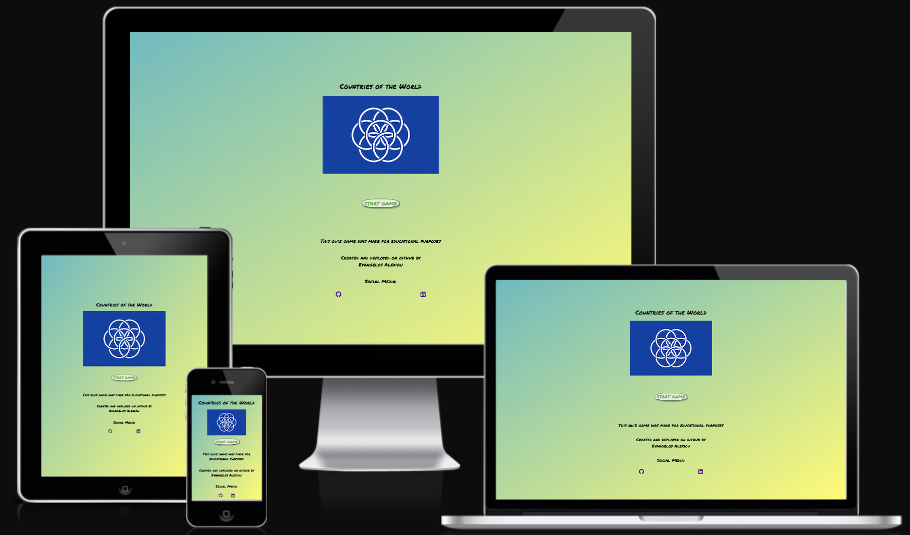

# COUNTRIES OF THE WORLD QUIZ
Countries of the World is an interactice quiz game that presents to the user a randomly selected flag at a time and offers four possible answers, asking the user which country is being displayed each time. It is ideal for all age groups from the younger ages to older ones and it has as a main purpose to enhance the knowledge of this specific topic in an entertaining way.

The live site can be found [here](https://alexiou981.github.io/countries-of-the-world-quiz/)

## **Features**
### *Existing Features*

- __Landing Page__
- The landing page consist of:
    - The game title.
    - The earth flag the game is related to it's countries.
    - The start button that runs the game.
    - The footer that consist of the clickable social media links, purpose of the game and credits to the creator.

    

- __Gameplay Area__
- The gamepla area consist of:
    - The game title which stays on display throughout the entire game.
    - It outputs to the user the flag that was picked randomly out of the choices array.
    - It also, offers four possible answers with immediate validation (correct or incorrect answer).
    - At the bottom of the page is displayed the currect player score.

- __Result Screen__
- The result screen:
    - Announces the final result of the game.
    - Offers the user two options for exiting or restarting the game.

- __Exit Screen__

- __Styling Choices__

    - The color palette was created using [Coolors](https://coolors.co/)

    - I choose those colors in order to give the game a playful and relaxing mood.

    - There is sufficient contrast between background and foreground for enhances readability.

- __Typography__

- The font used for this game is Permanent Marker and was taken from Google Fonts.
- I choose this specific family since I wanted to give it a school-like type writing since it's an educational game.

### *Potential Futute Features*

## **Testing**

- The website was tested through various devices and prooven to be responsive in all screen sizes using the Google Chrome Inspector.
- All links to social media open in a new page.
- All images are displayed on the deployed site as well and there are no broken links or contents.

### *Validator Testing*

### *Unfixed Bugs* 

## **Repository and Workspace Set Up**
-  Creating a repository on Github.com:
    - Click on the Repositories tab.
    - On the top right-hand corner there is a green button that says "New", click on that.
    - Give the new repository a name, "sourdough-enthusiasts" in this case.
    - Ensure the repository is public by clicking on the Public button under the Description field.
    - Click on the Add README file in order to have this file included automatically.
    - Lastly, at the bottom right-hand corner click on "Create repository".
    - The new repository should be now available on the repositories tab on Github.

- Creating a workspace on Codeanywhere.com:
    - Login to your account, in this case I logged in using my github account.
    - On the workspaces tab click on the "New Workspace".
    - Go back to your Github repositories page and find the repository you want to create a workspace for, in this case, sourdough-enthusiasts.
    - Click on the repository and inside of it at the top right-hand corner there is a button that says "Code".
    - Click on the code button and copy the https URL from it.
    - Paste this URL in codeanywhere inside the "Create from your project repository" field.
    - Click on the bottom right-hand corner the green button that says create.
    - After a little while the workspace should be up and running.

## **Deployment** 
The website was deployed using Github.com. 
- The steps followed were: 
    - In the github repository (sourdough enthusiasts) click on the Setting tab, right under the search bar.
    - On the left hand-side of the page click on Pages inside the Code and Automation section.
    - Ensure the source is selected as "deploy from branch" and the branch is set to "main".
    - Once the main branch is selected the page should be deployed automatically. It will display at the top of the page that the site is deployed and indicate the link to access the site.

The live link of the website is: https://alexiou981.github.io/sourdough-enthusiasts/ 

## **Credits**
### *Content*

### *Media* 
- All flag images were sourced from this website: https://www.worldometers.info/geography/flags-of-the-world/